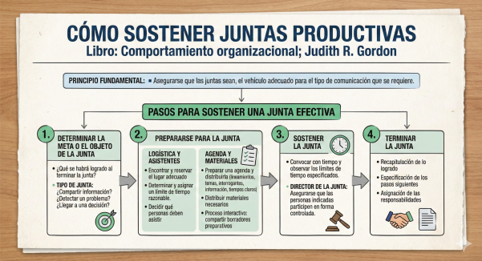

## Comentario personal

Lo que mas me gusto del video es que fue directo y aterrizado. No se queda en pura teoria; te da ideas que puedes aplicar en cualquier reunion desde el mismo dia.

Los puntos que mas rescato son estos:

- Toda junta debe tener un objetivo claro antes de empezar.
- Solo deben asistir las personas necesarias, no por compromiso.
- Al cierre tienen que quedar acuerdos concretos, con responsables definidos.
