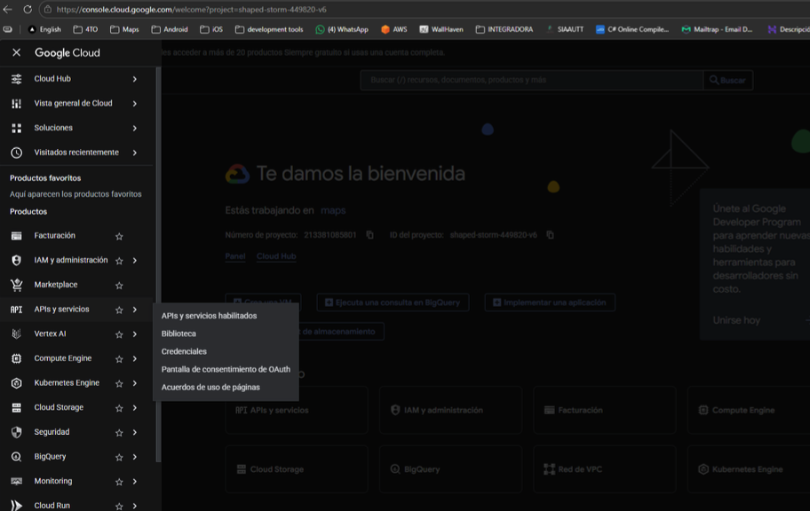
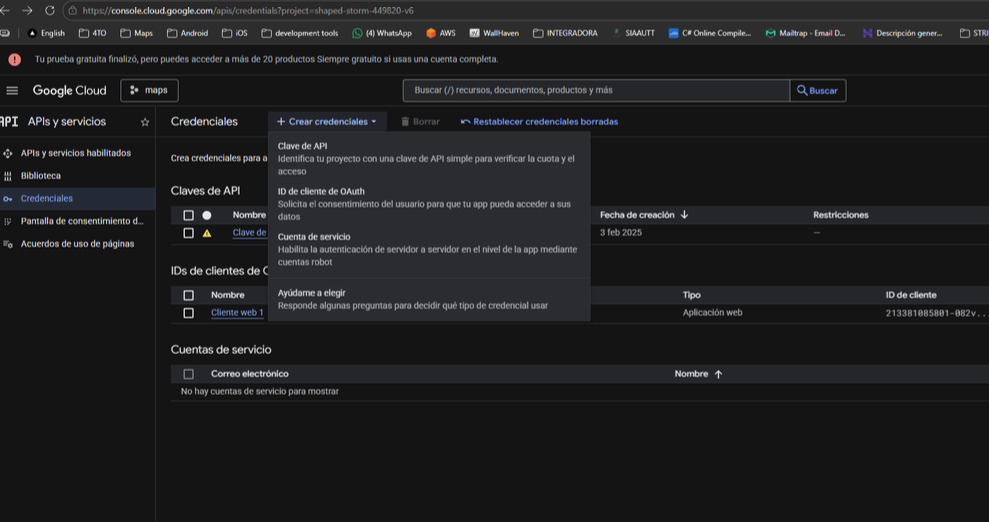
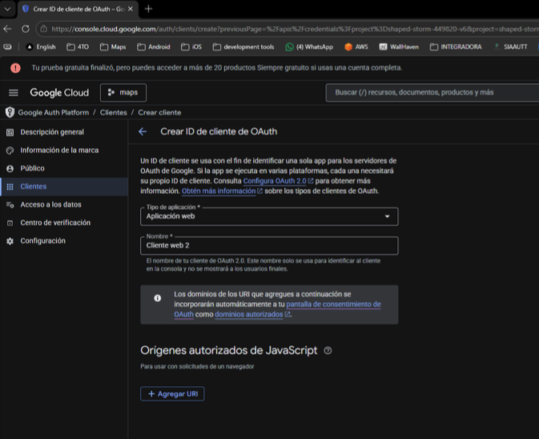
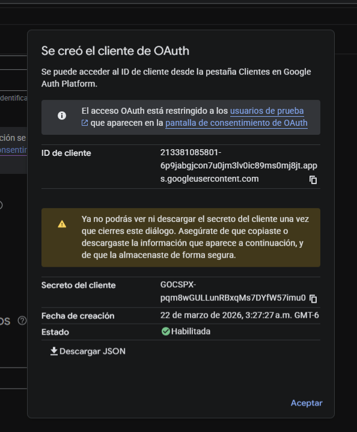

# Manual de Implementación de OAuth 2.0 en Sistemas de Autenticación

Este manual describe los pasos técnicos y conceptuales necesarios para integrar el flujo de inicio de sesión mediante proveedores externos (como Google, GitHub o Microsoft) utilizando el protocolo OAuth 2.0.

## 1. Conceptos Fundamentales

Antes de la implementación, es vital entender los roles:

- **Resource Owner:** El usuario final.
- **Client:** Tu aplicación/servidor.
- **Authorization Server:** El proveedor (Google, GitHub, etc.).
- **Resource Server:** La API del proveedor que contiene los datos del usuario.

## 2. Registro en el Panel de Desarrolladores

Cada proveedor requiere que registres tu aplicación para obtener credenciales.

1.  Crea un proyecto en la consola del proveedor (ej. Google Cloud Console).
2.  Configura la **Pantalla de Consentimiento**: Define qué datos pedirás (email, perfil).
3.  Crea **Credenciales de OAuth 2.0**:
    - **Client ID:** Identificador público de tu app.
    - **Client Secret:** Clave privada (NUNCA debe exponerse en el cliente/frontend).
4.  Configura las **URIs de Redireccionamiento (Callback URLs)**: La ruta de tu servidor que procesará la respuesta del proveedor (ej. `https://tuapp.com/api/auth/callback`).

## 3. Flujo de Implementación (Authorization Code Grant)

### Paso A: Redirección al Proveedor

En tu interfaz de login, el botón de "Iniciar sesión con..." debe redirigir al usuario a la URL de autorización del proveedor con los siguientes parámetros:

- `client_id`: Tu ID de cliente.
- `redirect_uri`: La URL de callback registrada.
- `response_type`: Siempre `code`.
- `scope`: Los permisos solicitados (ej. `openid email profile`).
- `state`: Un token aleatorio para prevenir ataques CSRF.

### Paso B: El Usuario Autoriza

El usuario inicia sesión en el sitio del proveedor y acepta compartir sus datos con tu aplicación.

### Paso C: Recepción del Código de Autorización

El proveedor redirige al usuario de vuelta a tu `redirect_uri` con un parámetro `code` en la URL:
`https://tuapp.com/api/auth/callback?code=4/P7q7W91&state=xyz123`

### Paso D: Intercambio de Código por Token (Lado del Servidor)

Tu servidor debe realizar una petición POST interna al proveedor para cambiar el `code` por un `access_token`.
**Parámetros del POST:**

- `code`: El código recibido.
- `client_id` & `client_secret`.
- `grant_type`: `authorization_code`.

### Paso E: Obtención de Datos del Usuario

Con el `access_token`, tu servidor hace una petición a la API del proveedor (Userinfo endpoint) para obtener los detalles del usuario (nombre, email, ID único).

## 4. Integración con tu Base de Datos

Una vez obtenidos los datos:

1.  **Verificación:** Busca si el email o el ID del proveedor ya existe en tu DB.
2.  **Registro/Actualización:** Si no existe, crea un nuevo usuario. Si existe, actualiza su información si es necesario.
3.  **Sesión Local:** Genera tu propio token de sesión (como un JWT) o una cookie para mantener al usuario autenticado en tu plataforma.

## 5. Consideraciones de Seguridad

- **Uso de HTTPS:** Obligatorio para proteger los tokens.
- **Validación de State:** Siempre verifica que el parámetro `state` devuelto coincida con el que enviaste inicialmente.
- **Secretos:** Almacena el `Client Secret` en variables de entorno (`.env`), nunca en el código fuente.
- **Scopes Mínimos:** Solicita solo la información estrictamente necesaria.
